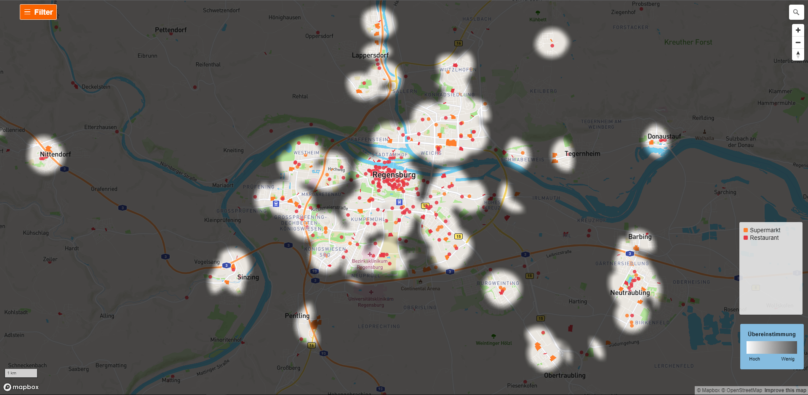

# About this Project

This application was built as part of my Bachelor's Thesis "Erweiterung und Optimierung eines Tools zum interaktiven Finden geeigneter Orte". The aim of the Thesis was to improve a previously designed application by Michael Meckl (https://github.com/michaelmeckl/BA-Ein-Haus-am-See). The aims were twofold. For one, the application should be improved in terms of efficiency and performance by adding a PostGIS database and optimizing other processes. Furthermore, the aim was to improve the overall usability and functionality by adding new features and evaluating the UI.



This application uses data provided by OpenStreetMap to help users find ideal places on a map by visualizing the information of their environments. They can specifiy the distance to those geographic points and combine them to create a filtered map.

## Built with

- [React.js]("https://reactjs.org/")
- [OpenStreetMap]("https://www.openstreetmap.org/")
- [MapBox]("https://www.mapbox.com/")
- [MobX]("https://mobx.js.org/README.html")
- [WebGL]("https://get.webgl.org/")

## Branches

Its important to note that there were multiple versions created in the design of this application.

- The Master Branch contains the final version
- the Branch dev-old contains the Re-Implementation of the initial application
- The Branch dev-optimization contains a Mixed version, where the UI and functions are the same as initially but with optimized processes

# Getting Started

## Prerequisites

To use this application, a PostGIS Database needs to be available at a specified Port.

### Database Setup

1. Install PostGreSQL with a PostGIS extension locally
2. Install Osm2pgsql (https://osm2pgsql.org/doc/install.html)
3. Use the commandline to load the data by using the [Lua-File]("https://github.com/MatthiasDobiosz/ein-haus-am-see-ba/dbSetup/einhausamsee.lua") and a OpenStreetMap-datafile.

Command:

```
**Path\to\osm2pgsql** -c --slim --drop -d **YourDatabaseName** -U **YourUsername** -W -H **YourDatabaseIP** -O flex -S **Path\to\Luafile** **Path\to\OsmDataFile**
```

If you have a Database set up, you can create and specify the config-File as seen [here]("https://github.com/MatthiasDobiosz/ein-haus-am-see-ba/shared/config.example.ts") with your port and password.

## Build Project

To the build the project you need to install yarn

```sh
npm install yarn@latest -g
```

After that you can install and start the application:

```
yarn install
yarn start
```

After Starting, the website should open automatically in your browser under http://localhost:5173/. Since this Website uses WebGL and there have been some problems when using FireFox, I'd suggest using another browser for it to work correctly. Next you can see a demo on how the website should function.

## Demo


## License

The project is licensed under the MIT License.
